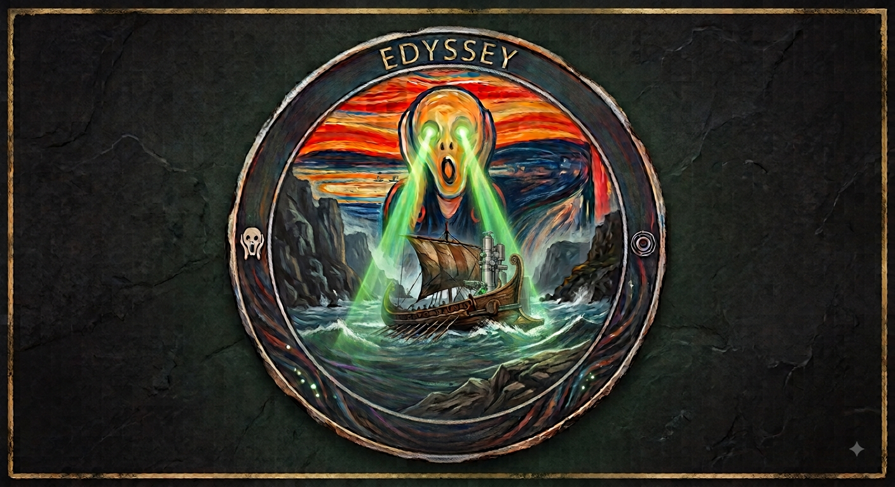

# EDyssey

EDyssey is a PyQt5 desktop application for processing
and analyzing 4D-STEM Tomography data (scanning electron diffraction) datasets. It covers a range of necessary steps to reach the final 3D ED dataset.
The normal workflow is:
- Checking the 4D-STEM Files on ROI on 4D tab
- Create a stack of images from navigation images (with virtual detectors) on Navigator tab
- Track particles or regions of interest by either classical opencv trackers or MetaAI's SAM2
- Extract 3D ED frames from the segmented regions
The software currently supports raw ASI's tpx3, QD's mib, Hyperspy's hspy and zspy data types.

<!-- screenshot: docs/screenshot.png -->

## Install

**Windows installer (recommended):** two variants, both installing the same
app - no Python setup required either way:

- **Online** (small, ~200MB): download `EDyssey_Setup_Online_<version>.exe` from the
  [Releases](https://github.com/SalehGholam/EDyssey/releases) page. The SAM2
  checkpoint and Nano/DaSiamRPN tracker model files download automatically
  the first time you use those specific features, instead of being bundled
  upfront.
- **Offline** (large, ~2.6GB): bundles those same model files, plus
  `torch`/CUDA/`sam2` themselves, so nothing needs to be downloaded or
  installed later - not even on first use of the SAM2 tab. Not published
  on GitHub (too large for a Release asset) - ask whoever maintains this
  repo for a copy, or build it yourself (see Development below).

**From source:** see [INSTALL.md](INSTALL.md).

With the online installer (or running from source), SAM2 support needs one
extra manual step (`torch` + the `sam2` package aren't bundled or
auto-installed, since the right build depends on your GPU/CUDA version) -
see INSTALL.md's "Enabling SAM2" section. The offline installer already
includes both, so SAM2 works immediately after install.

## Usage

- [MANUAL.md](MANUAL.md) - full walkthrough of all four tabs (ROI on 4D,
  Navigator, Tracking by CV2, SAM2 Seg.), saving/resuming analyses, and
  keyboard shortcuts.
- [CONTROLS.md](CONTROLS.md) - canvas mouse control reference for the
  tracking tabs.

## Development

- Tests: `pytest tests/`
- Lint: `ruff check .`
- Building the Windows installer:
  - Online: `pyinstaller EDyssey.spec`, then `iscc installer\EDyssey_online.iss`.
  - Offline: `set EDYSSEY_OFFLINE_BUILD=1` first, then
    `pyinstaller EDyssey.spec --distpath dist_offline --workpath build_offline`,
    then `iscc installer\EDyssey_offline.iss` - needs `torch`/`sam2` and the
    model weight files present locally first (see its header comment).

  See [EDyssey.spec](EDyssey.spec)'s header comment for the overall
  packaging rationale.

## Acknowledgements 
Many thanks to Arno Annys for the support.

## AI Usage
Many parts of the user interface and build of the installers are developed by the help of large language models. The code has been tested to work properly, but not every line has been reviewed by the user. The logo is made by Nano Banana 2.

## License

GPL-3.0 - see [LICENSE](LICENSE). This follows from two runtime
dependencies (PyQt5, HyperSpy) that are themselves GPLv3, which doesn't
allow a more permissive or usage-restricted license on top.

Some model weights are downloaded on demand rather than bundled - see
[THIRD_PARTY_NOTICES.md](THIRD_PARTY_NOTICES.md) for what each one is,
its license, and where it comes from (one of them, the NanoTrack tracker
model, currently has an unclear license - flagged there).
